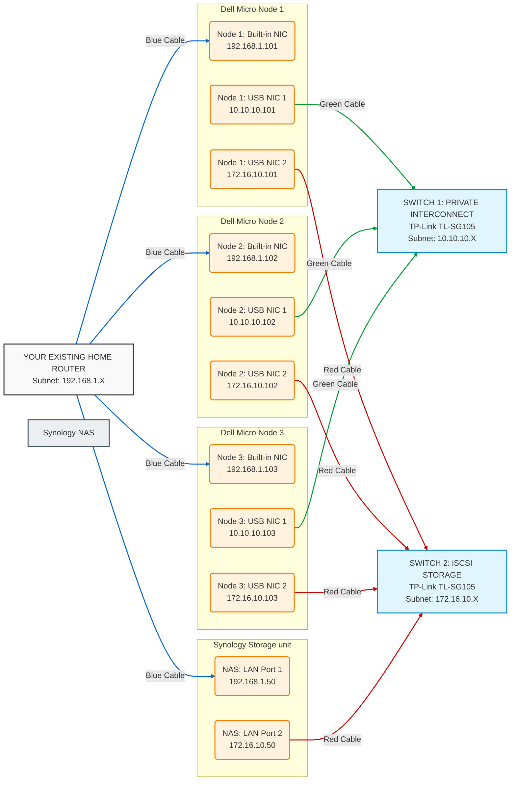

# Homelab Oracle 26ai RAC Project

## Network Topology

```mermaid
flowchart LR
 subgraph subnetwork1["Dell Micro Node 1"]
        PublicCable1("Node 1: Built-in NIC<br>192.168.1.101")
        PrivateCable1("Node 1: USB NIC 1<br>10.10.10.101")
        StorageCable1("Node 1: USB NIC 2<br>172.16.10.101")
  end
 subgraph subnetwork2["Dell Micro Node 2"]
        PublicCable2("Node 2: Built-in NIC<br>192.168.1.102")
        PrivateCable2("Node 2: USB NIC 1<br>10.10.10.102")
        StorageCable2("Node 2: USB NIC 2<br>172.16.10.102")
  end
 subgraph subnetwork3["Dell Micro Node 3"]
        PublicCable3("Node 3: Built-in NIC<br>192.168.1.103")
        PrivateCable3("Node 3: USB NIC 1<br>10.10.10.103")
        StorageCable3("Node 3: USB NIC 2<br>172.16.10.103")
  end
 subgraph NAS_Unit["Synology Storage unit"]
        PublicCable4("NAS: LAN Port 1<br>192.168.1.50")
        StorageCable4("NAS: LAN Port 2<br>172.16.10.50")
  end
    Router["YOUR EXISTING HOME ROUTER<br>Subnet: 192.168.1.X"] -- Blue Cable --> PublicCable1 & PublicCable2 & PublicCable3 & PublicCable4
    PrivateCable1 -- Green Cable --> Switch1["SWITCH 1: PRIVATE INTERCONNECT<br>TP-Link TL-SG105<br>Subnet: 10.10.10.X"]
    PrivateCable2 -- Green Cable --> Switch1
    PrivateCable3 -- Green Cable --> Switch1
    StorageCable1 -- Red Cable --> Switch2["SWITCH 2: iSCSI STORAGE<br>TP-Link TL-SG105<br>Subnet: 172.16.10.X"]
    StorageCable2 -- Red Cable --> Switch2
    StorageCable3 -- Red Cable --> Switch2
    StorageCable4 -- Red Cable --> Switch2
    NAS["Synology NAS"]

     Router:::router
     Switch1:::switch
     Switch2:::switch
     NAS:::nas
    classDef router fill:#f9f9f9,stroke:#333,stroke-width:2px
    classDef switch fill:#e1f5fe,stroke:#0288d1,stroke-width:2px
    classDef node fill:#fff3e0,stroke:#f57c00,stroke-width:2px
    classDef nas fill:#eceff1,stroke:#455a64,stroke-width:2px
    linkStyle 0 stroke:#0066cc,stroke-width:2px,fill:none
    linkStyle 1 stroke:#0066cc,stroke-width:2px,fill:none
    linkStyle 2 stroke:#0066cc,stroke-width:2px,fill:none
    linkStyle 3 stroke:#0066cc,stroke-width:2px,fill:none
    linkStyle 4 stroke:#009933,stroke-width:2px,fill:none
    linkStyle 5 stroke:#009933,stroke-width:2px,fill:none
    linkStyle 6 stroke:#009933,stroke-width:2px,fill:none
    linkStyle 7 stroke:#cc0000,stroke-width:2px,fill:none
    linkStyle 8 stroke:#cc0000,stroke-width:2px,fill:none
    linkStyle 9 stroke:#cc0000,stroke-width:2px,fill:none
    linkStyle 10 stroke:#cc0000,stroke-width:2px,fill:none
```
### (Mermaid version)
```mermaid
  info
```
